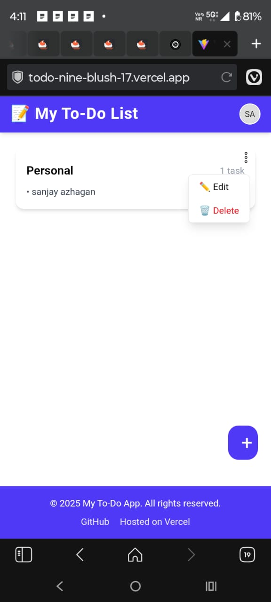
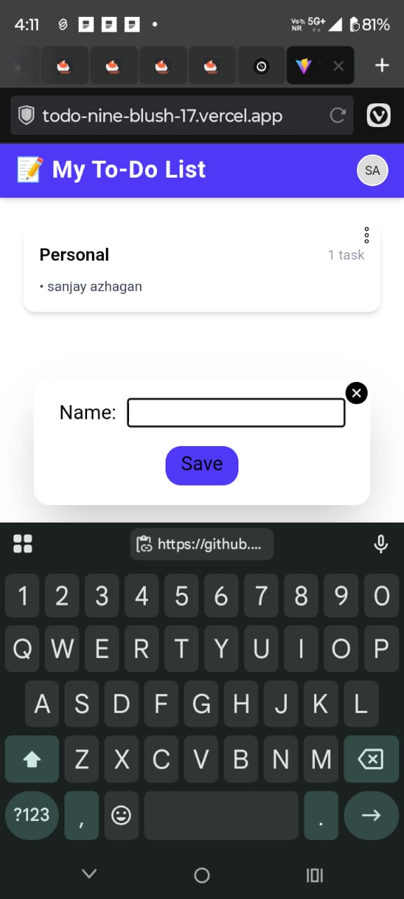
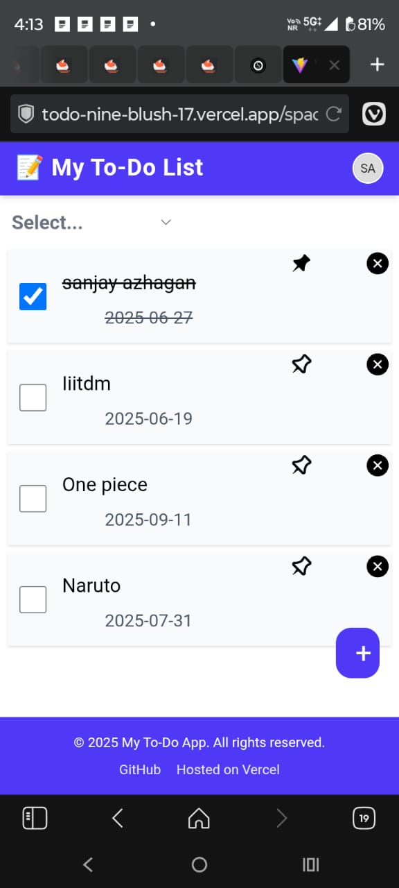
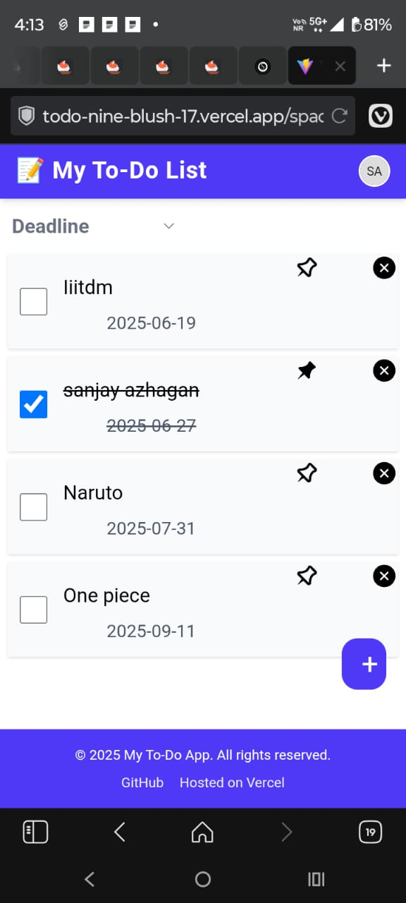
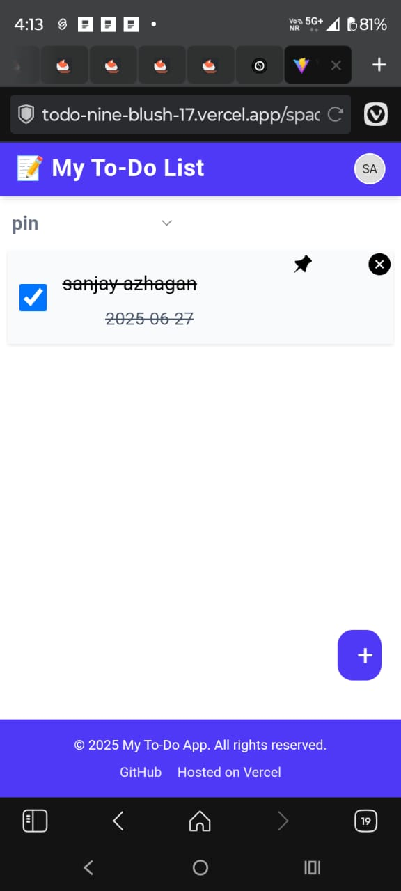

🚀 Project ToDo
A short tagline or description of your project.

📑 Table of Contents
About

Features

Tech Stack

Getting Started

Usage

Screenshots

Contributing

License

📖 About
🔹 Space Management
Create new Spaces to organize tasks by context (e.g., Work, Study, Personal)

Edit and delete existing Spaces

📝 To-Do List per Space
Add tasks specific to each Space

Edit task titles and deadlines

Delete tasks when no longer needed

✅ Task Controls
Mark tasks as completed

Pin important tasks to prioritize them

Set and update deadlines

🔍 Smart Filters
Filter tasks by:

All

Pinned

Completed

Upcoming deadlines

Quickly find what matters most

🧠 Organized and User-Friendly
Minimal, distraction-free interface

Real-time updates with no reloads

Contextual task grouping within Spaces

This is a simple to-do list app built using React. It allows users to create, delete, and mark tasks as completed.

✨ Features
🗂️ Space Management
Create multiple Spaces to organize tasks by category (e.g., Work, Study, Personal)

Edit and delete existing Spaces

✅ To-Do List per Space
Add, edit, and delete tasks within each Space

Set deadlines for each task

Mark tasks as completed

Pin important tasks to keep them at the top

🔍 Task Filtering
Filter tasks by:

All Tasks

Pinned

Completed

Upcoming Deadlines

💡 User Experience
Clean, intuitive, and responsive UI

Real-time task updates

Fully organized workspace per Space
🛠 Tech Stack
Frontend: React, Tailwind CSS

🧑‍💻 Getting Started
Prerequisites
Make sure you have the following installed:

Node.js

npm / yarn

Installation
bash
Copy
Edit
# Clone the repo
git clone https://github.com/Sanjayazhagan/Todo.git

# Navigate to the project directory
cd Todo

# Install dependencies
npm install

# Start the development server
npm run dev

Once started, the app will be available at:

http://localhost:5173
You can now:

Add new tasks

Edit or delete them

Toggle completion

See changes persist via LocalStorage/API

📸 Screenshots
Include screenshots or GIFs of your application in action:

Make sure the screenshots folder is in your project directory.

🤝 Contributing
Feel free to contribute. Fork the repo and open a pull request.

🪪 License
This project is licensed under the MIT License - see the LICENSE file for details.