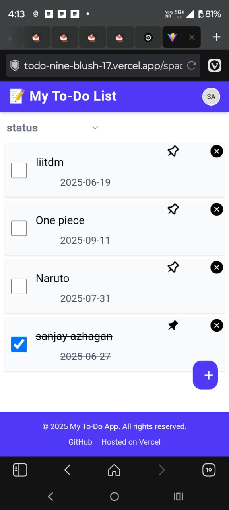

🚀 Project ToDo
A short tagline or description of your project.

📑 Table of Contents
About

Features

Tech Stack

Getting Started

Usage

Screenshots

Contributing

License

📖 About
This project is a Space-based To-Do List Manager that helps users stay organized by allowing them to create and manage multiple Spaces. Each Space acts as a separate workspace, containing its own To-Do List.

Within each Space, users can:

Create, edit, and delete tasks

Pin important tasks to prioritize them

Mark tasks as completed

Set and manage task deadlines

Filter tasks by various criteria

Additionally, tasks that miss their deadlines are visually highlighted in red, helping users quickly identify overdue items.

✨ Features
🗂️ Space Management
Create multiple Spaces to organize tasks by category (e.g., Work, Study, Personal)

Edit and delete existing Spaces

✅ Task Controls
Add, edit, and delete tasks within each Space

Set and update deadlines for each task

Mark tasks as completed

Pin important tasks to keep them at the top

Overdue tasks automatically turn red to indicate missed deadlines

🔍 Task Filtering
Filter tasks by:

All Tasks

Pinned

Completed

Upcoming Deadlines

💡 User Experience
Clean, intuitive, and responsive UI

Real-time task updates without page reloads

Organized, context-based task management within Spaces
Fully organized workspace per Space
🛠 Tech Stack
Frontend: React, Tailwind CSS

🧑‍💻 Getting Started
Prerequisites
Make sure you have the following installed:

Node.js

npm / yarn

Installation
bash
Copy
Edit
# Clone the repo
git clone https://github.com/Sanjayazhagan/Todo.git

# Navigate to the project directory
cd Todo

# Install dependencies
npm install

# Start the development server
npm run dev

Once started, the app will be available at:

http://localhost:5173
You can now:

Add new tasks

Edit or delete them

Toggle completion

See changes persist via LocalStorage/API

📸 Screenshots
Include screenshots or GIFs of your application in action:

Make sure the screenshots folder is in your project directory.

🤝 Contributing
Feel free to contribute. Fork the repo and open a pull request.

🪪 License
This project is licensed under the MIT License - see the LICENSE file for details.